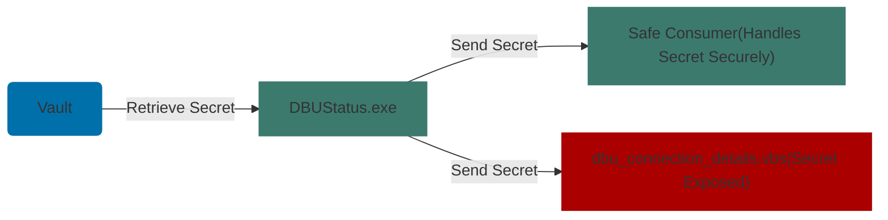

# Intro

Secrets management can be a pain, from discovering all of the issues in code, to excel files on desktops, to standing up proper vaults and convincing people to use them. But let's say you have done *all this*. Pop the champagne, tell your boss to give you a huge bonus, leaked secrets have been conquered…or have they?

Storing and retrieving secrets is only half the battle. Secrets are meant to be used; it's during this use that many often overlooked issues can arise. Even if you follow all of the traditional best practices, secrets can still be leaked. My discovery of CVE-2025-48709 in BMC’s Control-M Server demonstrates this.

Control-M is used in many environments to process sensitive financial transactions such as payment processing, end of day reconciliations, and data transfer between systems. Unauthorized access to the database for this solution could provide attackers with additional credentials used for integrations with other systems, the ability to disrupt payment workflows, and create new records or modify existing ones.

<table>
  <tr>
    <th>CVE-2025-48709</th>
  </tr>
  <tr>
    <td><strong>Description:</strong> 
    An issue was discovered in BMC Control-M 9.0.21.300. When Control-M Server has a database connection, it runs DBUStatus.exe frequently, which then calls dbu_connection_details.vbs with the username, password, database hostname, and port written in cleartext, which can be seen in event and process logs in two separate locations.
    </td>
  </tr>
  <tr>
    <td><strong>CVSS:</strong> 
      6.1 Medium 
      CVSS:4.0/AV:N/AC:L/AT:P/PR:L/UI:N/VC:H/VI:L/VA:L/SC:L/SI:L/SA:L
    </td>
  </tr>
  <tr>
    <td><strong>CWE:</strong> 
    CWE-532: Insertion of Sensitive Information into Log File
    </td>
  </tr>
  <tr>
    <td><strong>Patched:</strong> 
    Control-M Server 9.0.21.307
    </td>
  </tr>
  <tr>
    <td><strong>References:</strong> 
    <a href="https://www.cve.org/CVERecord?id=CVE-2025-48709">CVE-2025-48709</a> 
    <a href="https://docs.bmc.com/xwiki/bin/view/Control-M-Orchestration/Control-M/ctm9021/Patches/Control-M-Server-PACTV-9-0-21-307/">Patch Notes</a>
    </td>
  </tr>
</table>
  

---

# Secure Storage and Retrieval isn't Enough

Though the purpose of this post is to shed light on the ways secrets can still be leaked when following well known best practices, these guidelines are still important. The standards below should be the foundation of any strong AppSec program:

- First, always implement methods to discover secrets in your environment. This includes SAST tooling for your code repositories and DLP tools to search your endpoints for files containing passwords or keys.
- After identifying the areas of weakness in your environment, implement solutions for your developers to securely manage and store secrets. This can include cloud native tools such as Azure Key Vault and AWS Secrets Manager, hosted vaults such as HashiCorp Vault and Bitwarden, or full fledged PAM solutions like CyberArk and BeyondTrust.
- Finally, work with developers to help create reusable patterns that work within their existing use cases rather than forcing them to rearchitect solutions. This will drastically improve adoption rates.

Implementing the strategies above will remove many low hanging fruit that threat actors or offensive security teams use to move laterally through your environment. Now let's explore the lesser talked about ways that secrets can still be exposed while following these best practices.

The next step is to understand how these secrets will be used once retrieved by the processes that need them. This can become even harder in enterprise software with large teams of developers working on multiple different features at once. We need to consider various logging sources such as operating system event logs, debugging logs, web traffic logs, and network logs. Additionally, it is important to understand how a secret is handled when passed between multiple different functions, binaries, or services. Anyone who has worked on a large development project will know that when it’s crunch time and a release deadline is coming up, some *jank* solutions make their way into the release as a “temporary fix.” These solutions often become permanent, because “it works!” Let’s use the vulnerability in Control-M to further explore these concepts.
  

---

# CVE-2025-48709 Case Study

First I will explore the pattern that caused the vulnerability and how it supports the ideas discussed above. The DBUStatus.exe binary uses a DLL to fetch credentials for the Control-M database from Windows credential manager. These credentials are then used within the binary, but the issue arises when dbu_connection_details.vbs is involved. This script is expecting a username, password, hostname, and port to be passed to it in the command line. This is also the case when this script is called by the DBUStatus.exe binary; this important information is then logged in Windows event logs if command line auditing is enabled. This information is also stored in any areas these logs are forwarded to, such as application monitoring or security tools, giving attackers multiple areas to gain access to them.

Below is a small diagram of this dataflow:

The vulnerability in Control-M highlights issues that can be created when developing complex software between multiple teams. In many cases, once one feature has been built that retrieves a secret it will be reused by many other new functions later. This is why it's important to understand where and how secrets are being used in the different components, and to understand if they are being used in a secure fashion. 
  

---

# Post-Retrieval Defense Strategies

Understanding and keeping track of the data that is flowing between different parts of an application is an important part of building a threat model. Here are some additional things to include in an AppSec program and why it is important to approach assessing software security with an offensive mindset:
- **Code reviews and whitebox pentesting:** While SAST tools will find the locations of hardcoded secrets in code, they will struggle to find issues that arise at integration points between different services. The most effective way to do this is by performing a whitebox pentest. Experienced offensive security professionals will understand where to look for these issues and providing them with access to code will allow them to track down the source of exposure.
- **Controlling secrets validity length:** Another effective strategy is to rotate secrets in a short timeframe. Ideally, these would be rotated after each use, which would render them useless if found in a log. This frequency of rotation is unachievable for many organizations, but creating a programmatic way to rotate important secrets, even on a monthly basis, will reduce the impact of leaks. 
- **Audit dataflows in new features:** Make reviewing what data is flowing in and out of a new feature a requirement before go live. This gives the developers who know the application best a chance to see if there are any potential areas of leakage in the new feature and how it integrates with the rest of the code.

Adding these practices to the software development lifecycle will improve the protection of important assets that allow attackers to move laterally in an environment. The use of valid identities can be one of the harder things for defensive security teams to catch, especially if these are machine identities like API keys or secrets for cloud services.

Secrets management is about understanding and securing the entire lifecycle of your secrets. I hope you found these ideas interesting and useful. In the future, I may explore tools that help map secrets ownership.